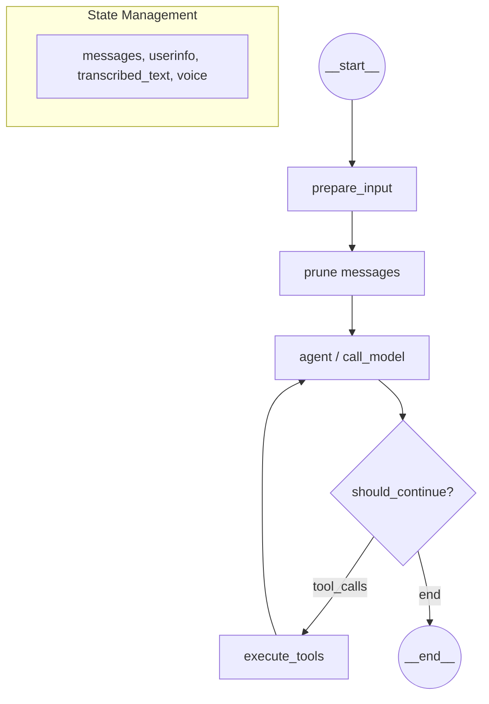

# Graph Design Overview

```mermaid
graph TD
    START((__start__)) --> prepare_input[prepare_input]
    prepare_input --> prune[prune messages]
    prune --> agent[agent / call_model]
    
    agent --> condition{should_continue?}
    
    condition -- "tool_calls" --> execute_tools[execute_tools]
    execute_tools --> agent
    
    condition -- "end" --> END((__end__))

    subgraph State Management
    GraphState[messages, userinfo, transcribed_text, voice]
    end
```